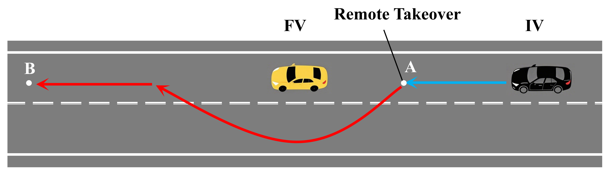
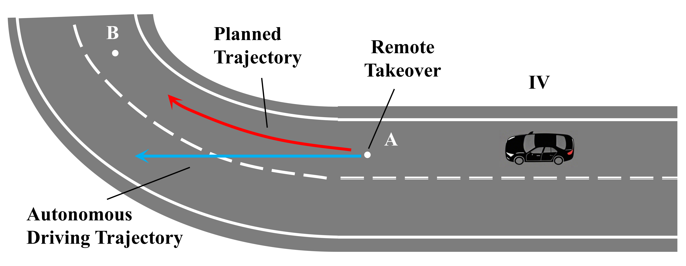

# Trajectory Prediction-Based Adaptive Takeover Method 

## 1. Project Overview

This project implements an adaptive takeover method based on trajectory prediction for mobile robot teleoperation systems under communication delay, with the goal of improving the safety and smoothness of the takeover process in delayed communication environments.

The proposed method first predicts the future trajectory of the vehicle under autonomous control and then issues a proactive takeover request. Next, an LSTM model is used to predict the human intention trajectory. An MPC controller tracks the intention trajectory to reconstruct the original human input. By adaptively allocating control authority between the robot’s autonomous input and the reconstructed human input, the method enables a smooth transfer of control.

The proposed method is validated through simulations in a CARLA-based remote driving environment. The code is available in this repository, which includes two independent experimental tasks: overtaking and obstacle avoidance (Task A) and lane departure correction (Task B).

## 2. File Structure
<pre>
├── Task_A                                                    # Overtaking and obstacle avoidance module
│   ├── TaskA.py                                                # Main program for Task A
│   ├── collectiondataA.py                                      # Data collection for human intention trajectory in Task A
│   ├── trajectory_prediction.py                               # Trajectory prediction algorithm for Task A
│   └── lstm_trajectory_predictor_gpu.pth                      # Pretrained LSTM trajectory predictor
│
├── Task_B                                                    # Lane departure correction module
│   ├── TaskB.py                                                # Main program for Task B
│   ├── collectiondataB.py                                      # Data collection for human intention trajectory in Task B
│   ├── trajectory_prediction.py                               # Trajectory prediction algorithm for Task B
│   └── lstm_trajectory_predictor_gpu.pth                      # Pretrained LSTM trajectory predictor
│
├── README.md
├── requirements.txt                                           # Project dependencies
├── framework.png                                              # Method framework diagram
├── mpc_parameters.md                                          # MPC parameter settings for different tasks and speed conditions
├── wheel_config.ini                                           # Logitech G29 steering wheel configuration file 
├─  route_a.png                                           
└── route_b.png                                         
</pre>

## 3. Environment

- OS: Windows 11 (x64)
- CARLA: 0.9.11  
  Download: https://github.com/carla-simulator/carla/releases
- Python: 3.7

## 4. Module Functions

Each task includes three code modules:

- `main.py`: Main script for the experiment, used to execute the takeover control process.
- `collectiondata.py`: Used for collecting data associated with the human intention trajectory.
- `trajectory_prediction.py`: Used for trajectory prediction and for generating the `.pth` model file.

## 5. Task Description

- Task A: Overtaking and Obstacle Avoidance 
  In this task, an intelligent vehicle (IV) is assigned to transport supplies from point A to point B. However, a faulty vehicle (FV) is stalled at a random position 25-35 m ahead of point B, which is not considered in the original autonomous driving design of the IV. This unexpected obstacle prevents the IV from completing the task safely under autonomous control alone. Therefore, remote human takeover is required to guide the vehicle around the obstacle and continue the transportation mission to point B.

     
- Task B: Lane Departure Correction
  In this task, the IV follows a pre-planned route and is expected to maintain lane-keeping along the road centerline in an urban remote driving scenario. However, when the IV reaches point A, external disturbances cause the actual driving trajectory to deviate from the planned path. As a result, remote takeover by a cloud-based safety operator is required. The operator then controls the IV to drive approximately 80 meters to point B.
  

## 6. Usage Workflow

- The two tasks are independent and follow the same workflow.
- Install the CARLA simulator and prepare a Logitech G29 steering wheel controller. The experiments depend on both components.
- Before running the experiments, make sure the Logitech G29 hardware is properly connected and that the required driver or configuration software is installed so that the steering wheel can be recognized by the system.
- With CARLA running, execute `collectiondata.py` to collect data associated with the human intention trajectory.
- Run `trajectory_prediction.py`  to perform intention trajectory prediction and generate the trained model file (`.pth`).
- With CARLA running, execute `main.py` to perform the takeover operation.
- The parameters can be adjusted to adapt the method to different scenarios.

## 7. Other Notes

- The runtime dependencies are listed in `requirements.txt`.
- MPC parameters for different speeds and tasks are provided in `mpc_parameters.md`.
- If GPU memory is insufficient, you can launch CARLA in low-quality mode using: `CarlaUE4.exe -quality-level=Low`
- When running `main.py`, `wheel_config.ini` must be placed in the same directory as `main.py`.

